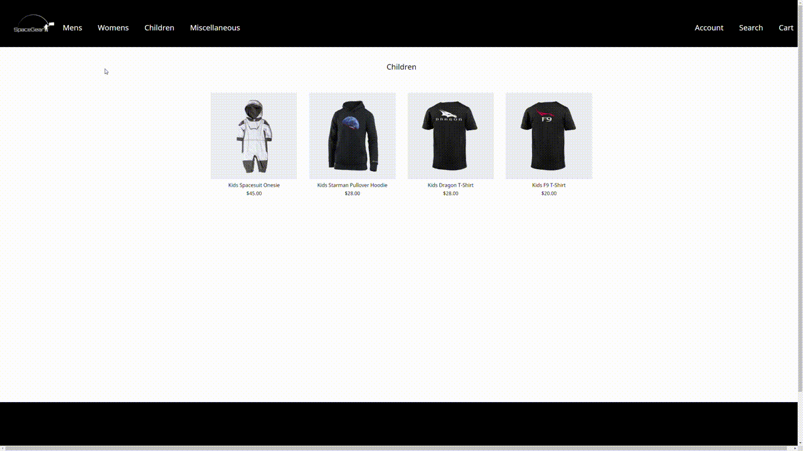
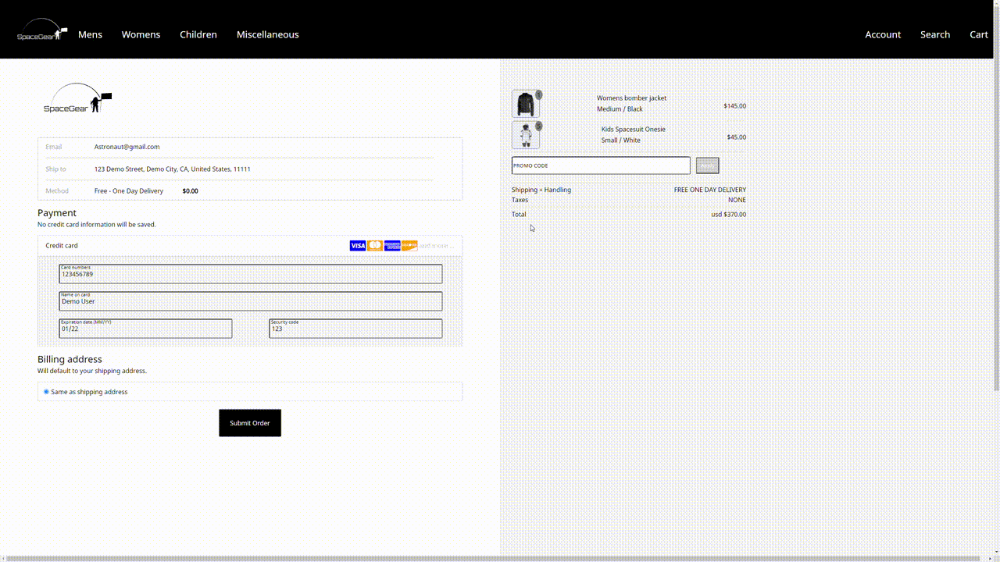

# SpaceGear

[SpaceGear](https://spacegear.herokuapp.com/#/) is an ecommerce site inspired by Space Exploration Technologies Corp. (SpaceX). The site offers aerospace themed merchandise. Users can browse products by category and type, add products to a shopping cart, and checkout products. Users may also edit prior orders made. 


## Technologies Utilized 

* PostgreSQL 10.15
* Rails 5.2.4.4
* React 17.0.1
* Redux
* Ruby
* JavaScript
* HTML
* CSS

## Key Features 

### Shopping Cart 



Users can store items in a shopping cart. The cart reflects the products stored, the quantity, and the total cost of all products in the cart. Users can also update the cart at any point and receive instant feedback based on changes made. This feature was implemented using localStorage to cache products allowing them to persist in the cart through refresh. Utilizing localStorage also eliminated the need to make frequent queries to the backend.

```javascript 
    cartItems() {
        // retrieves items in the cart and returns an array of items 
        let cart = JSON.parse(localStorage.getItem('cart'));
        if(cart) {
            let items = Object.keys(cart)
            items = items.map( (key) => {
                return cart[key]
            })
            return items 
        } else {
            return [];
        }
    }
```


```javascript 
    updateQuantity({product}) {
        // updates the quantity of products in the cart and recalculates total 
        return(e) => { 
            let newQuantity = isNaN(parseInt(e.currentTarget.value)) ? 0 : e.currentTarget.value
            let oldCart = JSON.parse(localStorage.getItem('cart')); 
            let newCart = Object.assign({}, oldCart, { [product.id]: { 'quantity': newQuantity, 'product': product} }) 
            localStorage.setItem('cart', JSON.stringify(newCart))
            this.total();
        }
    }
```

### Ordering Products 



Users can checkout items in their shopping cart. Upon checkout a new entry is created on the `orders` table. The `orders` table contains the `total`, `purchaser_id`, `address_id`, and `payment_id`. Simulataneously the ordered products and their quantities are recorded on the `ordered_products` table. Queries to the database are made via jQuery.ajax() calls. In order to work with the asynchronous ajax() call and avoid making multiple queries to the database, Rails active record associations was utilized to write to multiple tables simultaneously. Specifically, a mixture of nested attributes and has many through associations was utilized between the `orders` and `ordered_products tables`.

```javascript 
class Order < ApplicationRecord
    
    has_many :ordered_products, dependent: :destroy
   
    has_many :products, 
        through: :ordered_products,
        source: :product

    belongs_to :orderer, 
        foreign_key: :purchaser_id, 
        class_name: :User

    belongs_to :address, 
        foreign_key: :address_id, 
        class_name: :Contact 

    accepts_nested_attributes_for :ordered_products, allow_destroy: true
end
```

```javascript
    def order_params 
        # utilizing nested attributes to write to multiple tables  
        params.require(:order).permit(:purchaser_id, :total, :address_id, ordered_products_attributes: [:id, :product_id, :quantity, :_destroy])
    end
```


